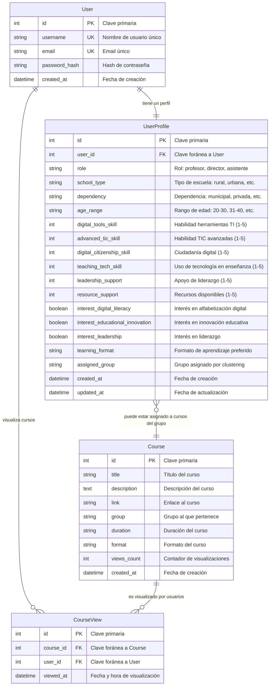

# Diagrama de Entidad-Relación - Sistema EduRecom

## Descripción del Diagrama de Entidad-Relación

### **1. Entidades Principales**

#### **User (Usuario)**
- **Propósito**: Almacena información básica de autenticación de usuarios
- **Clave primaria**: `id` (autoincremental)
- **Claves únicas**: `username`, `email`
- **Atributos**: Información de identificación y autenticación
- **Cardinalidad**: 1 usuario tiene exactamente 1 perfil

#### **UserProfile (Perfil de Usuario)**
- **Propósito**: Almacena información detallada del perfil educativo
- **Clave primaria**: `id` (autoincremental)
- **Clave foránea**: `user_id` → `User.id`
- **Atributos principales**:
  - **Habilidades digitales**: Escala 1-5 para diferentes competencias
  - **Contexto educativo**: Tipo de escuela, dependencia, rol
  - **Intereses**: Booleanos para preferencias de formación
  - **Grupo asignado**: Resultado del algoritmo de clustering
- **Cardinalidad**: 1 perfil pertenece a exactamente 1 usuario

#### **Course (Curso)**
- **Propósito**: Representa los cursos de formación disponibles
- **Clave primaria**: `id` (autoincremental)
- **Atributos principales**:
  - **Contenido**: Título, descripción, enlace
  - **Clasificación**: Grupo, duración, formato
  - **Métricas**: Contador de visualizaciones
- **Cardinalidad**: 1 curso puede ser visualizado por muchos usuarios

#### **CourseView (Visualización de Curso)**
- **Propósito**: Rastrea las interacciones de usuarios con cursos
- **Clave primaria**: `id` (autoincremental)
- **Claves foráneas**: `course_id` → `Course.id`, `user_id` → `User.id`
- **Atributos**: Timestamp de visualización
- **Cardinalidad**: Conecta usuarios y cursos para tracking

### **2. Relaciones entre Entidades**

#### **User ↔ UserProfile (1:1)**
- **Tipo**: Composición obligatoria
- **Descripción**: Cada usuario debe tener exactamente un perfil
- **Restricciones**: No puede existir un usuario sin perfil ni un perfil sin usuario

#### **User ↔ CourseView (1:N)**
- **Tipo**: Agregación opcional
- **Descripción**: Un usuario puede visualizar múltiples cursos
- **Restricciones**: Un usuario puede no haber visualizado ningún curso

#### **Course ↔ CourseView (1:N)**
- **Tipo**: Agregación opcional
- **Descripción**: Un curso puede ser visualizado por múltiples usuarios
- **Restricciones**: Un curso puede no haber sido visualizado por ningún usuario

#### **UserProfile ↔ Course (N:1)**
- **Tipo**: Asociación opcional por grupo
- **Descripción**: Los perfiles pueden estar asignados a cursos según su grupo
- **Restricciones**: La asignación depende del algoritmo de clustering

### **3. Características del Diseño**

#### **Normalización**
- **1NF**: Todos los atributos son atómicos
- **2NF**: No hay dependencias parciales
- **3NF**: No hay dependencias transitivas

#### **Integridad Referencial**
- **Cascade Delete**: Al eliminar un usuario se elimina su perfil
- **Foreign Keys**: Todas las relaciones están correctamente definidas
- **Constraints**: Validaciones a nivel de base de datos

#### **Escalabilidad**
- **Índices**: En claves primarias y foráneas
- **Particionamiento**: Posible por grupos de cursos
- **Cache**: Para consultas frecuentes de recomendaciones

### **4. Ventajas del Diseño**

1. **Separación de Responsabilidades**: Autenticación separada del perfil educativo
2. **Flexibilidad**: Perfiles dinámicos con campos configurables
3. **Tracking**: Seguimiento completo de interacciones de usuarios
4. **Clustering**: Soporte para algoritmos de recomendación
5. **Auditoría**: Timestamps para todas las entidades principales

Este diagrama ERD proporciona una visión clara de la estructura de datos del sistema EduRecom, mostrando cómo se organizan las entidades y sus relaciones para soportar el sistema de recomendación basado en clustering.
